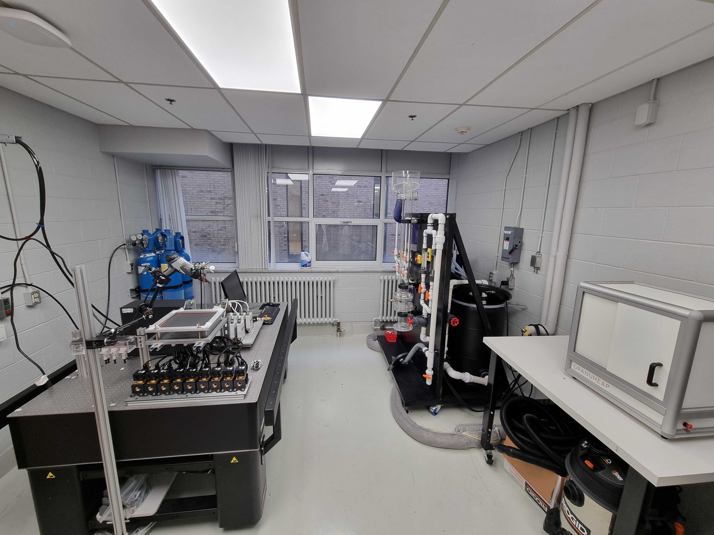
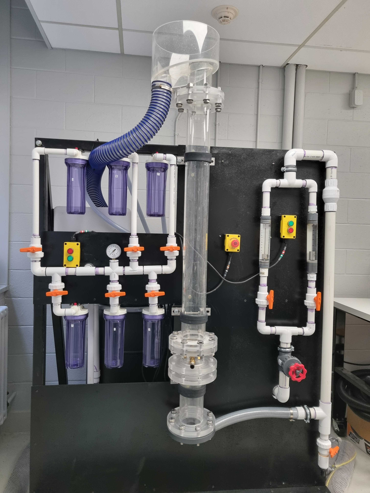
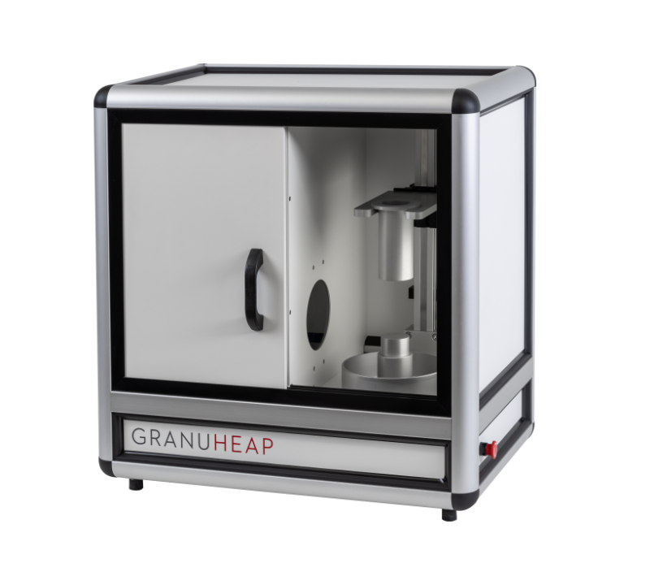

---
hide:
  - navigation
---

# Experimental infrastructure

The CHAOS Laboratory has dedicated experimental infrastructure. Check out our facilities!

---

## Experimental facility { width="400" align=right }

The CHAOS Laboratory's experimental space houses a complete infrastructure to safely conduct experiments involving fluid and granular dynamics, multiphase flow and heat transfer.

      

---

## Custom experimental setups

The marjority of our experimental units are custom. Their modular design allows for a variety of applications and regimes.

### **Three-phase fluidization column** { width="325" align=right }

Including two centrifuge pumps, two water tanks, a dedicated system for overflow particle collection, flowmeters, valves, and a discharge system; our three-phase fluidization column can be used to investigate particle and fluid dynamics of liquid-solid, gas-liquid-solid, and gas-liquid systems.

The setup's instrumentation allows for fine control of liquid flow rates between 1 and 50 gpm (approx. 4 and 190 L/min).

The column modules can be easily replaced, allowing for changes in the column dimensions and shape while using the same structure.

     

---

### **Active Cooling Device** { width="450" align=right }

Used for testing advanced control strategies applied to thermal management, the Active Cooling Device allows for the control of up to 10 gas mass flow controllers (MFCs) and 10 solenoid valves while tracking surface temperature using an infra-red camera.

The device is built with a custom PCB that establishes the interface between all hardware components with a Raspberry Pi. It also includes a custom application with a friendly User Interface that allows for real-time tracking of flow and temperature.

Still curious? Check out our [article](https://arxiv.org/abs/2510.18987) with its full description and our repository on [Zenodo](https://zenodo.org/records/15644038).

---

## Particles characterization

### **Granuheap** { width="450" align=right }

Manufactured by Granutools&trade;, Granuheap is an automated equipment that allows for the measurement of powders's angle of repose and cohesive index.

For further information, follow the [link](https://www.granutools.com/en/granuheap) to their official website.

