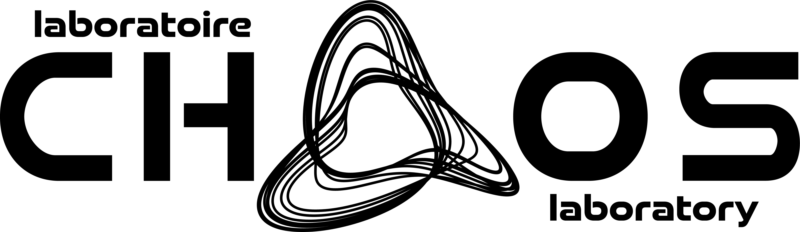

---
hide:
  - navigation
---

<h1 style="display: flex; flex-wrap: wrap; align-items: center; justify-content: space-between;">
  Welcome to the CHAOS Laboratory
  
  
</h1>

CHAOS (Chemical engineering High-performance Analysis, Optimization and Simulation) is a research laboratory specializing in the numerical modeling of unit operations and advanced manufacturing processes. It is recognized for its vertical integration—from the development of new mathematical models to their implementation in high-performance open-source software. These models are used to study the physics of single-phase, granular, and multiphase flows, as well as to design and optimize chemical processes.

  
    The CHAOS laboratory is part of the Department of Chemical Engineering of Polytechnique Montréal.
    The CHAOS lab is one of the few chemical engineering laboratories in Canada dedicated to developing
    software and algorithms optimized for modern high-performance computing architectures,
    positioning it at the forefront of technological innovation.
  

  

## Latest News

Stay tuned for updates on our latest research, publications, and events. Visit our [News](news.md) or [Blog](news.md) pages.

## Get Involved

Interested in collaborating with us or joining our team? Check out our [Team](team.md) page to learn more about our researchers, or visit our [Research](research.md) page to explore our current projects.

---

*For more information, please explore the navigation menu above.*
