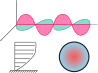
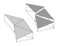

---
hide:
  - navigation
---

# Research

## Research Areas

??? tip "Computational Fluid Dynamics" 
    Our group simulates single-phase and multiphase flows relevant to chemical engineering. We focus on high-order finite element formulations for Newtonian and non-Newtonian fluids in single-phase, gas-liquid and liquid-liquid flows. We specialize in implicit LES for turbulent flows. We leverage Eulerian–Lagrangian (CFD–DEM) coupling to accurately capture fluid-solid interactions under realistic industrial conditions.  Applications range from spinning disc reactors, fluidized beds to additive manufacturing processes. The group combines large-scale simulations, and algorithmic innovation with experimental validation to improve predictive capabilities for chemical and manufacturing processes.

??? tip "Physics of Multiphase Flows"
    

      
      

        We use simulation and experiments to shed light on the physics of multiphase flows (both fluid–fluid and particle-laden flows). This knowledge guides the design or optimization of unit operations and manufacturing processes involving such flows.
      

    

??? tip "Multiphysics Simulations"
    

      
      

        Our research in multiphysics modelling focuses on the coupling of thermal, electromagnetic, fluid, and reactive phenomena to simulate and optimize complex engineering processes. We develop and apply high-performance computational frameworks for applications such as catalytic reactor optimization, additive manufacturing, active cooling systems, and microwave-assisted chemical processes
      

    

??? tip "High-Performance Computing"
    Our work in high-performance computing focuses on developing scalable numerical strategies for large-scale simulations of multiphase and granular flows. We aim to maximize computational efficiency on modern parallel architectures.  

??? tip "Numerical Methods"
    

      
      

        Our research centers on the design and implementatino of advanced numerical schemes for multiphysics and multiphase simulations. Current developments include high-order CFD-DEM formulations for particle-laden flows, discontinuous Galerkin and Petrov–Galerkin methods for fluid, transport and electromagnetism equations, and accurate diffuse and sharp interface treatments for multiphase flows. We also investigate efficient discretization and stabilization strategies, to improve accuracy and stability of numerical methods.
      

    

---

## Active Projects

### Multiphase simulation for powder bed additive manufacturing  a.1,a.2,b.1,d.1

**Description:** Powder spreading and melting are two critical stages in Laser Powder Bed Fusion (LPBF) that directly determine the final part quality, surface finish, and process reliability. Despite its technological maturity, LPBF still suffers from inconsistencies related to powder flowability, spreading uniformity, and melt pool stability, largely due to the complex and poorly understood multiphase interactions between solid particles, molten metal, and surrounding gas.

This project aims to develop a comprehensive multiphase numerical framework that integrates the Discrete Element Method (DEM) for powder spreading and a Volume of Fluid (VOF)-based thermo-fluid finite element model for melt pool dynamics. The DEM model will be constructed to simulate the powder spreading process, capturing the influence of particle shape, size distribution, surface roughness, and cohesion on the packing density and uniformity of the powder be. On the other hand, the thermo-fluid multiphase VOF solver will be developed to predict melt pool geometry (depth, width, and length) under various laser parameters and material conditions.

**Team Members:** Amishga Alphonius, Hélène Papillon Laroche and Olivier Gaboriault

### Graphite spheroidization  a.1,c.2

**Description:** The graphite spheroidization project, conducted in collaboration with Nouveau Monde Graphite Inc. (NMG), aims to improve the morphological control and energy efficiency of the spheroidization process used to produce battery-grade anode materials for lithium-ion cells. Current industrial methods rely heavily on empirical tuning of operating conditions, leading to high energy consumption and variable product quality.

To address these limitations, the project leverages the CFD-DEM capabilities of Lethe to simulate particle–particle and particle–wall interactions during the shaping process. By capturing key mechanisms such as abrasion, collision dynamics, and particle clustering, the model will provide predictive insight into the influence of process parameters on spheroidization efficiency and particle morphology.

**Team Members:** Charles Wilson and Jacob Tremblay

### Process intensification of multiphysics systems  a.1,b.1

**Description:** The transition toward more energy-efficient, compact, and sustainable chemical processes calls for a fundamental rethinking of conventional reactor design. To address this challenge, the present project aims to develop advanced numerical tools and modeling frameworks for process intensification in chemical reactors, with the ultimate goal of improving their energy efficiency, selectivity, and scalability.

More specifically, the research is structured around three complementary directions. The first focuses on developing a coupled electromagnetic–thermal model for multiphase systems to capture the unique volumetric heating characteristics of microwave-assisted processes. The second leverages artificial neural networks to accelerate the simulation of reactive porous media, enabling the exploration of a wider range of operating conditions and geometries. Finally, the third investigates a proof of concept for active cooling based on impinging jet systems to dynamically control local temperature gradients.

**Team Members:** Oreste Marquis, Victor Oliveira Ferreira, Olivier Guévremont, Wiebke Mainville

### Ultrasonic particle control  a.1,b.1

**Description:** The growing presence of microplastics in oceans poses a major environmental challenge, yet accurate characterization of their size distribution, composition, and concentration remains limited by the inefficiency of current sampling and analysis methods. This project aims to develop an ultrasonic-based particle manipulation and detection system to improve the quantification and classification of microplastic populations in aquatic environments.

The core innovation relies on the use of acoustic radiation forces to concentrate microplastics in a channel to perform Raman spectrocopy and characterize particles size, shape, and density. Through resolved CFD-DEM, the project investigates the coupling between ultrasonic wave propagation, fluid dynamics, and particle mechanics under controlled conditions.

**Team Members:** Justin Lamouche

---

## Past Projects

### Radioactive particle tracking (RPT)a.1

**Description:** The project introduces a novel model-free RPT technique for characterizing hydrodynamics in multiphase reactors. By replacing traditional radiation models with experimental data and training an artificial neural network, the approach significantly improves positional accuracy and eliminates extensive calibration. The method was validated in laminar and transitional stirred tank flows, accurately capturing vortex formation and key hydrodynamic parameters, and showing strong agreement with multiphase CFD simulations. 

**Duration:** September 2019 - December 2024

**Outcomes:** These results establish RPT as a reliable and efficient tool for studying complex flows in opaque reactors.

---

## Collaborations

We actively collaborate with:

- Academic institutions: a.1Polytechnique Montréal, a.2Technische Universität München;
- Research laboratories: b.1National Research Council;
- Industry partners: c.1ENIM, c.2Nouveau Monde Graphite Inc;
- International research groups: d.1Professorship of Simulation for Additive Manufacturing (SAM) at <em>Technische Universität München</em>.

---

## Funding

We are grateful for the support from various funding agencies and organizations. 

- [Natural Sciences and Engineering Research Council](https://www.nserc-crsng.gc.ca/)
- [Institut de l'énergie Trottier ](https://iet.polymtl.ca/)  
- [Fonds de recherche du Québec - Nature et technologies](https://frq.gouv.qc.ca/)

---

*This page is currently being updated. Please check back soon for more detailed information about our research projects.*