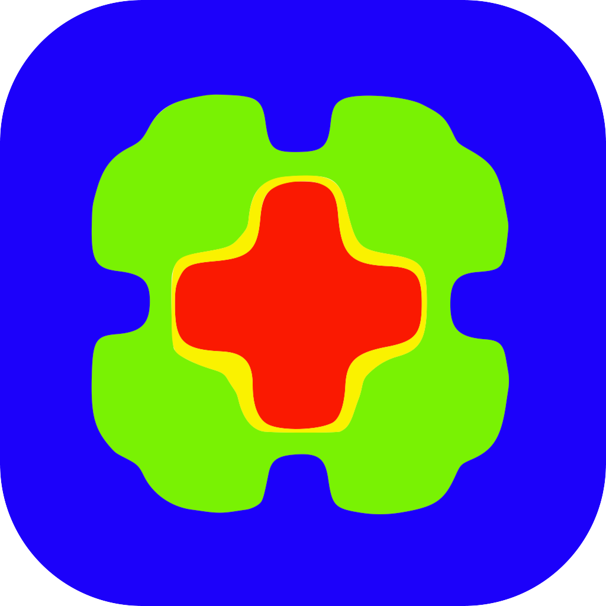

---
hide:
  - navigation
---

# Open-Source Software

The CHAOS Laboratory develops and contributes to high-performance open-source scientific software.

---

## Lethe { width="600" align=right }

**Lethe** is an open-source finite-element framework for multiphysics and multiphase flow simulations.  
It is designed for **high-performance computing** and includes advances features such as **mesh adaptation** and **dynamic load balancing**.

Lethe provides:
- Matrix-free stabilized solvers for incompressible Navier–Stokes equations  
- Multiphase capabilities (VOF)
- Discrete Element Method (DEM) solvers for granular and particulate flows  
- Coupled CFD-DEM and conjugate heat transfer capabilities  
- Advanced features for **additive manufacturing**, **process intensification**, and **particle transport**

Lethe is developed in C++ and built upon the deal.II finite-element library.  
All code is released under a dual **Apache-2.0 WITH LLVM-exception** or **LGPL-2.1-or-later** license.

> 🔗 [Lethe on GitHub](https://github.com/lethe-cfd/lethe).   
> 🌐 [Project website](https://chaos-polymtl.github.io/lethe/index.html)        
> 📘 [User documentation](https://chaos-polymtl.github.io/lethe/documentation/index.html)
 
---

## deal.II

{ width="150" align=right }

**deal.II** is a C++ program library targeted at the computational solution of partial differential equations using adaptive finite elements. It uses state-of-the-art programming techniques to offer you a modern interface to the complex data structures and algorithms required.

Key characteristics:
- Object-oriented, extensible architecture   
- Interfaces to major solver packages such as **Trilinos**, **PETSc**, and **p4est**  

deal.II serves as the foundation for Lethe’s core numerical infrastructure.  
The CHAOS Laboratory contributes actively to its ongoing development.

> 🔗 [deal.II official website](https://www.dealii.org)  
> 📦 [GitHub repository](https://github.com/dealii/dealii)  
> 📚 [Tutorials and documentation](https://www.dealii.org/current/doxygen/deal.II/)

---

## 🌍 Open-Science Philosophy

At CHAOS Lab, we believe that **reproducibility and transparency** are cornerstones of scientific progress.  
All our numerical methods, benchmarks, and simulation tools are released under open licenses and developed in public repositories.

---

*This page is currently being updated. Please check back soon for more information about our software projects.*
