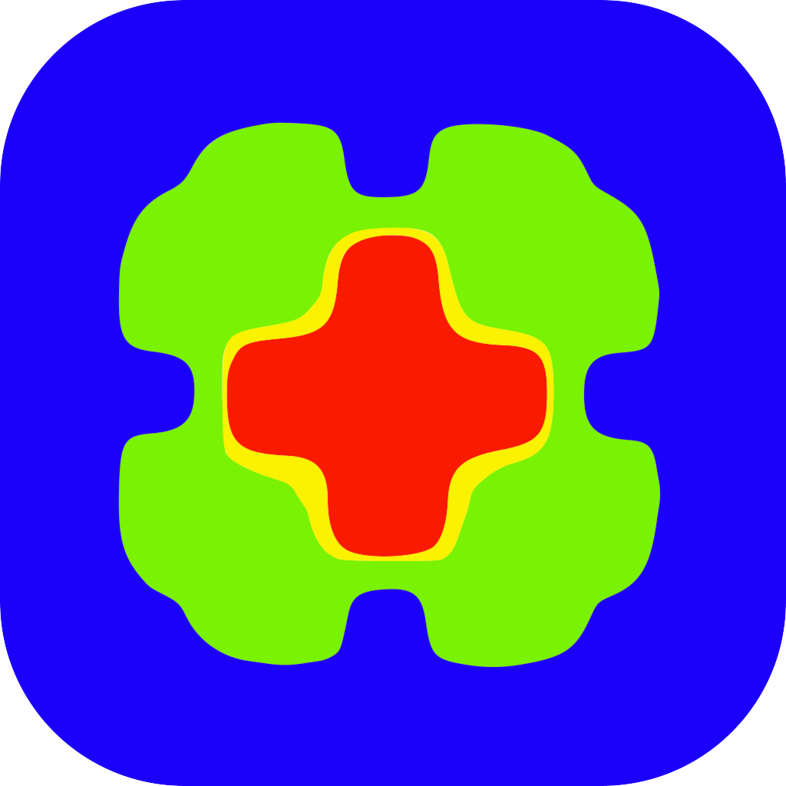

---
hide:
  - navigation
---

This page contains lectures or seminars that we have given throughout the years and that may be of general usages. 

## Specialized numerical methods for transport phenomena - deal.II { width="150" align=right }

Specialized numerical methods for transport phenomena is class taught at Polytechnique Montréal under the label GCH8108E. A major portion of the course is centered around learning the finite element method using the deal.II open-source library. Students progress from the basics of deal.II to assembling their own steady-state Navier-Stokes solver using the finite element method. Each lecture includes slides. There are four homeworks in total that cover the material of the course. Each homework consist of an homework statement and a C++ template. The entire content of the course is available below (by clicking on the themes). This class was authored by **Bruno Blais** and **Laura Prieto Saavedra**. If there is sufficient interest, we might transform these slides into a set of Youtube clip.

<a href="https://www.chaos-lab.ca/teaching/#specialized-numerical-methods-for-transport-phenomena-dealii">Specialized numerical methods for transport phenomena</a> © 2025 by <a href="https://www.polymtl.ca/expertises/en/blais-bruno">Bruno Blais</a> and Laura Prieto Saavedra is licensed under <a href="https://creativecommons.org/licenses/by-nc-sa/4.0/">CC BY-NC-SA 4.0</a>

???+ "Introduction to the course"
    - 📑 [Slides](lectures/GCH8108E/slides/intro.pdf)

??? "Introduction to C++ programming"
    - 📑 [Slides - Basic C++ and Bash](lectures/GCH8108E/slides/cpp_bash.pdf)
    - 📑 [Slides - Advanced C++](lectures/GCH8108E/slides/advanced_cpp.pdf)
    - 📑 [Slides - Additional C++](lectures/GCH8108E/slides/additional_cpp.pdf)

??? "Meshes: Triangulations in FEM"
    - 📑 [Slides](lectures/GCH8108E/slides/triangulation.pdf)

??? "Integration: Integrating over meshes using quadratures"
    - 📑 [Slides](lectures/GCH8108E/slides/integration.pdf)
    - 🧮 [Homework Statement](lectures/GCH8108E/homeworks/hw2.pdf)
    - 💻 [Homework Template](lectures/GCH8108E/homeworks_templates/template_hw2.zip)

??? "Interpolation in FEM"
    - 📑 [Slides](lectures/GCH8108E/slides/interpolation.pdf)

??? "Solving the Poisson equation in 1D"
    - 📑 [Slides](lectures/GCH8108E/slides/fem_poisson_1d.pdf)

??? "Towards FEM in 2D and 3D"
    - 📑 [Slides](lectures/GCH8108E/slides/fem_poisson_higher_dimensions.pdf)
    - 🧮 [Homework Statement](lectures/GCH8108E/homeworks/hw3.pdf)
    - 💻 [Homework Template](lectures/GCH8108E/homeworks_templates/template_hw3.zip)

??? "Transient and Transport Problems"
    - 📑 [Slides](lectures/GCH8108E/slides/fem_transient_transport.pdf)

??? "Non-linear Problems"
    - 📑 [Slides](lectures/GCH8108E/slides/fem_non_linear.pdf)
    - 🧮 [Homework Statement](lectures/GCH8108E/homeworks/hw4.pdf)
    - 💻 [Homework Template](lectures/GCH8108E/homeworks_templates/template_hw4.zip)

??? "Towards the Navier–Stokes Equations"
    - 📑 [Slides](lectures/GCH8108E/slides/fem_navier_stokes.pdf)
    - 🧮 [Homework Statement](lectures/GCH8108E/homeworks/hw5.pdf)
    - 💻 [Homework Template](lectures/GCH8108E/homeworks_templates/template_hw5.zip)

