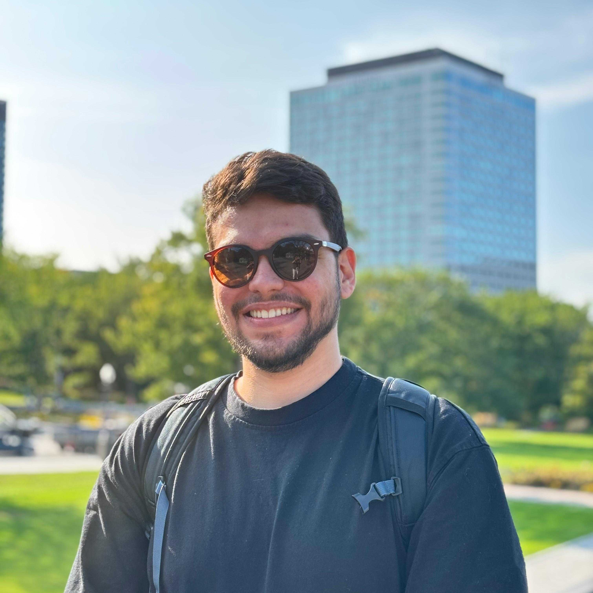
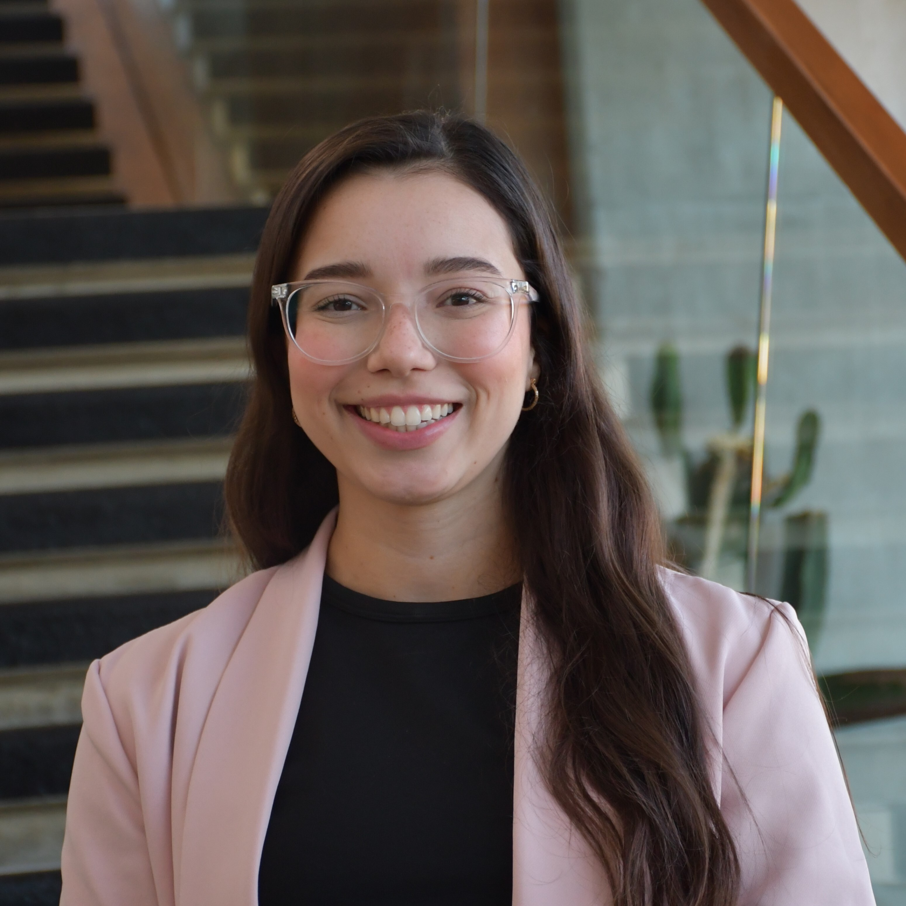
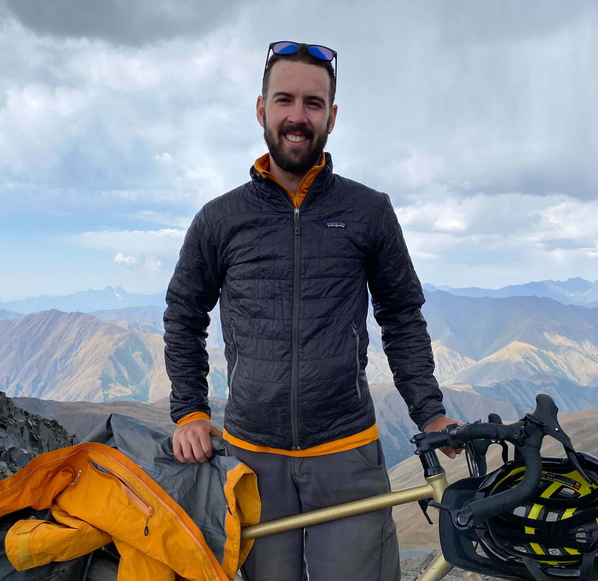
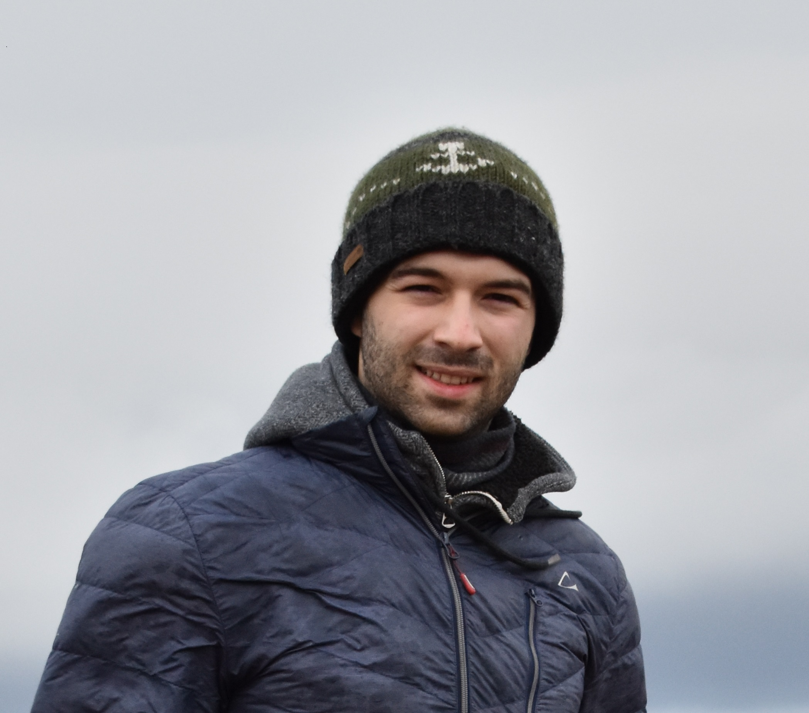
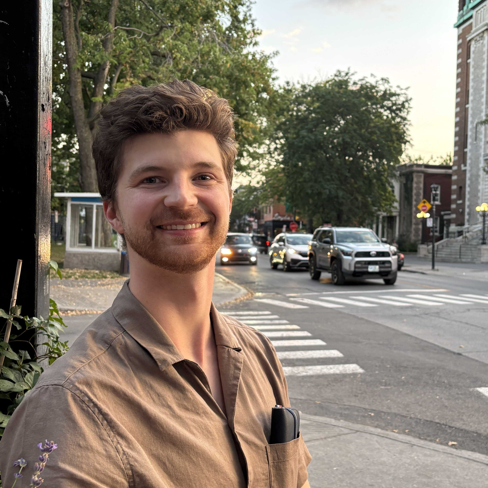
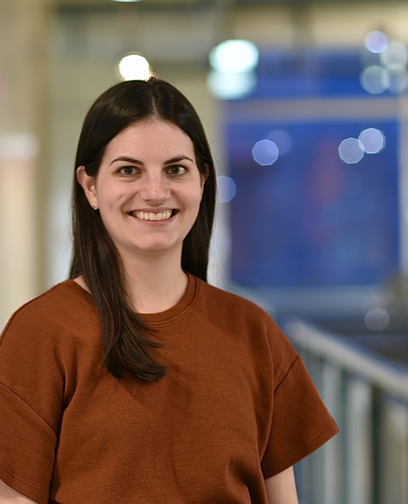
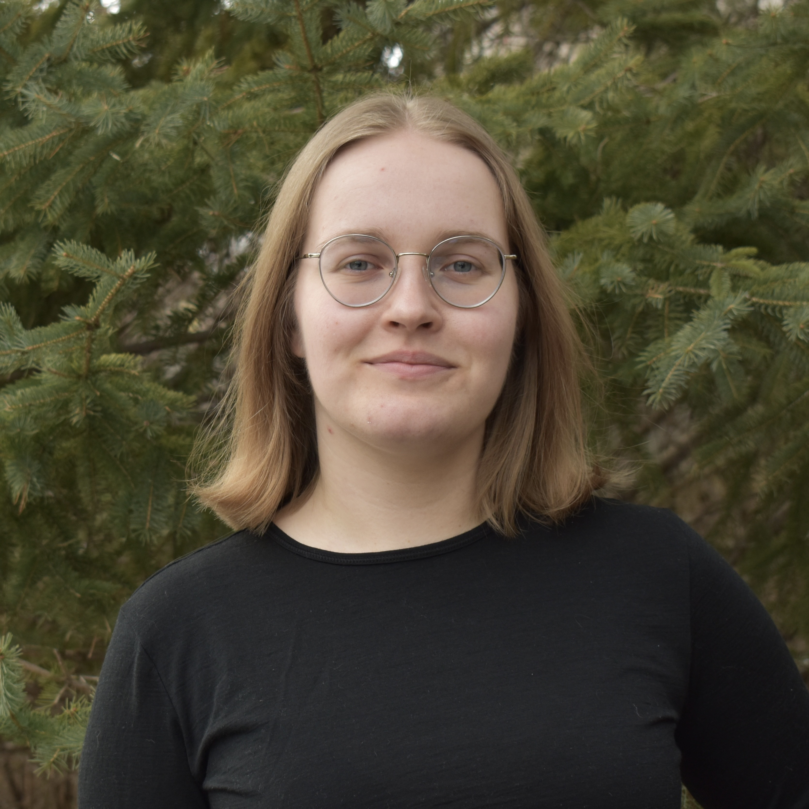
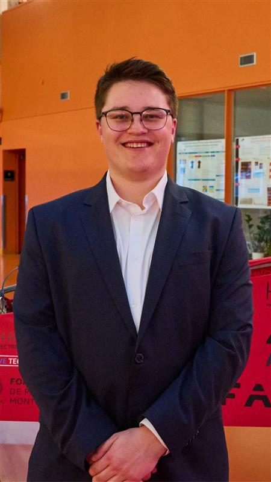

---
hide:
  - navigation
toc:
  depth: 2
---

# Team

Meet the talented members of the Chaos Laboratory.

---

<div class="team-section"></div>


## Principal Investigator


<div class="team-grid" markdown>

<div class="team-card" markdown>
<div class="team-card-image">
  
</div>
<div class="team-card-content" markdown>
<p class="team-card-name"><strong>Bruno Blais</strong></p>
<p class="team-card-position">Associate Professor</p>
<p class="team-card-research">
<strong>Research Focus:</strong>
<small>High-performance computing tailored towards multiphase flows and process intensification</small></p>
</div>
</div>
</div>

---

<div class="team-section"></div>

## Postdoctoral Fellows


<div class="team-grid" markdown>

<div class="team-card" markdown>
<div class="team-card-image">
  
</div>
<div class="team-card-content" markdown>
<h3 class="team-card-name">Victor Oliveira Ferreira</h3>
<p class="team-card-position">Postdoctoral Researcher</p>
<p class="team-card-research">
<strong>Research Project:</strong>
Process intensification with CFD and experimental methods
</p>
</div>
</div>

<div class="team-card" markdown>
<div class="team-card-image">
  
</div>
<div class="team-card-content" markdown>
<h3 class="team-card-name">Bruna Campos</h3>
<p class="team-card-position">Postdoctoral Researcher</p>
<p class="team-card-research">
<strong>Research Project:</strong>
TODO
</p>
</div>
</div>

<div class="team-card" markdown>
<div class="team-card-image">
  
</div>
<div class="team-card-content" markdown>
<h3 class="team-card-name">Antonella Succar</h3>
<p class="team-card-position">Postdoctoral Researcher</p>
<p class="team-card-research">
<strong>Research Project:</strong>
TODO
</p>
</div>
</div>

</div>

---

<div class="team-section"></div>


## PhD Students


<div class="team-grid" markdown>

<div class="team-card" markdown>
<div class="team-card-image">
  
</div>
<div class="team-card-content" markdown>
<h3 class="team-card-name">Oreste Marquis</h3>
<p class="team-card-position">PhD Candidate</p>
<p class="team-card-research">
<strong>Research Project:</strong>
Advanced finite element framework for multiphysics modeling of microwave heating in multiphase systems
</p>
</div>
</div>

<div class="team-card" markdown>
<div class="team-card-image">
  
</div>
<div class="team-card-content" markdown>
<h3 class="team-card-name">Olivier Guévremont</h3>
<p class="team-card-position">PhD Candidate</p>
<p class="team-card-research">
<strong>Research Project:</strong>
TODO
</p>
</div>
</div>

<div class="team-card" markdown>
<div class="team-card-image">
  
</div>
<div class="team-card-content" markdown>
<h3 class="team-card-name">Olivier Gaboriault</h3>
<p class="team-card-position">PhD Candidate</p>
<p class="team-card-research">
<strong>Research Project:</strong>
TODO
</p>
</div>
</div>

<div class="team-card" markdown>
<div class="team-card-image">
  
</div>
<div class="team-card-content" markdown>
<h3 class="team-card-name">Hélène Papillon Laroche</h3>
<p class="team-card-position">PhD Candidate</p>
<p class="team-card-research">
<strong>Research Project:</strong>
TODO
</p>
</div>
</div>

<div class="team-card" markdown>
<div class="team-card-image">
  
</div>
<div class="team-card-content" markdown>
<h3 class="team-card-name">Amishga Alphonius</h3>
<p class="team-card-position">PhD Candidate</p>
<p class="team-card-research">
<strong>Research Project:</strong>
TODO
</p>
</div>
</div>

<div class="team-card" markdown>
<div class="team-card-image">
  
</div>
<div class="team-card-content" markdown>
<h3 class="team-card-name">Charles Wilson</h3>
<p class="team-card-position">PhD Candidate</p>
<p class="team-card-research">
<strong>Research Project:</strong>
TODO
</p>
</div>
</div>

<div class="team-card" markdown>
<div class="team-card-image">
  
</div>
<div class="team-card-content" markdown>
<h3 class="team-card-name">Paul Alexander Patience</h3>
<p class="team-card-position">PhD Candidate</p>
<p class="team-card-research">
<strong>Research Project:</strong>
TODO
</p>
</div>
</div>

</div>

---

<div class="team-section"></div>


## Master's students


<div class="team-grid" markdown>

<div class="team-card" markdown>
<div class="team-card-image">
  
</div>
<div class="team-card-content" markdown>
<h3 class="team-card-name">Wiebke Mainville</h3>
<p class="team-card-position">Master's Student</p>
<p class="team-card-research">
<strong>Research Project:</strong>
Control strategies for an active cooling system.
</p>
</div>
</div>

<div class="team-card" markdown>
<div class="team-card-image">
  
</div>
<div class="team-card-content" markdown>
<h3 class="team-card-name">Jacob Tremblay</h3>
<p class="team-card-position">Master's Student</p>
<p class="team-card-research">
<strong>Research Project:</strong>
TODO
</p>
</div>
</div>

<div class="team-card" markdown>
<div class="team-card-image">
  
</div>
<div class="team-card-content" markdown>
<h3 class="team-card-name">Justin Lamouche</h3>
<p class="team-card-position">Master's Student</p>
<p class="team-card-research">
<strong>Research Project:</strong>
Computational modeling of acoustically driven particle-laiden flows.
</p>
</div>
</div>

</div>

---

<div class="team-section">

<h2><strong>Interns</strong></h2>

</div>

<div class="team-grid" markdown>

<div class="team-card" markdown>
<div class="team-card-image">
  
</div>
<div class="team-card-content" markdown>
<h3 class="team-card-name">Marine Harel</h3>
<p class="team-card-position">Research Intern</p>
<p class="team-card-research">
<strong>Research Project:</strong>
TODO
</p>
</div>
</div>


</div>

---

## Alumni

We are proud of our alumni who have gone on to successful careers in academia and industry.

- Laura Prieto Saavedra, Ph. D., 2025
- Mikael Vaillant, M. Sc., 2025
- Ghazaleh Mirakhori, Ph. D., 2024
- Pierre Joseph Eric Laurentin, M. Sc., 2024
- Audrey Collard-Daigneault, M. Sc., 2024
- Lucka Barbeau, Ph. D., 2024
- Toni El Geitani Nehme, Ph. D., 2023
- Valérie Bibeau, M. Sc., 2023
- Carole-Anne Daunais, M. Sc., 2022
- Shahab Golshan, post-doc, 2022
- Jeanne Joachim, post-doc, 2022
- Bastien Delacroix, M. Sc., 2019

### Ph.D.

- **Laura Prieto Saavedra** (2025) 
    - **Thesis Title**: Development of an Efficient Stabilized Navier-Stokes Solver to Simulate Turbulent Flows in Process-Intensified Devices
    - **Current position**: [Scientist and Research Software Engineer - Weierstrass Institute](https://www.wias-berlin.de/contact/staff/index.jsp?lang=1&uname=prieto)

- **Ghazaleh Mirakhori** (2024)  
    - **Thesis Title**: 
    - **Current position**: 

- **Lucka Barbeau** (2024)  
    - **Thesis Title**: Vers une approche CFD-DEM résolue d'ordre élevé pour la simulation directe d'écoulements autour d'essaims de particules
    - **Current position**: Research Officer - National Research Council Canada

- **Toni El Geitani Nehme** (2023)
    - **Thesis Title**: Development of a Robust Eulerian-Lagrangian Model for Process Intensification of Gas Fluidized and Spouted Beds
    - **Current position**: Associate Data Scientist - Amgen

### M. Sc.

- **Mikael Vaillant** (2025) 
    - **Thesis Title**: 
    - **Current position**: 

- **Pierre Joseph Eric Laurentin** (2024) 
    - **Thesis Title**: 
    - **Current position**: 

- **Audrey Collard-Daigneault** (2024) 
    - **Thesis Title**: 
    - **Current position**: 

- **Valérie Bibeau** (2023)  
    - **Thesis Title**: 
    - **Current position**:

- **Carole-Anne Daunais** (2022)
    - **Thesis Title**: 
    - **Current position**: 

- **Bastien Delacroix** (2019)
    - **Thesis Title**: 
    - **Current position**: 

### Post-Doc

- **Shahab Golshan** (2022) 
- **Jeanne Joachim** (2022)  


---


## Join Us

We are always looking for talented and motivated individuals to join our team. If you are interested in:

- **Graduate Studies**: M. Sc. or Ph. D. opportunities in computational science and engineering;
- **Postdoctoral Research**: Advanced research positions in multiphysics simulations;
- **Visiting Researchers**: Collaborative research opportunities;
- **Internships**: Undergraduate and graduate research internships.

Please contact us with your CV and research interests. We welcome applications from diverse backgrounds and are committed to fostering an inclusive research environment.

---

<!--
*Note: Replace the placeholder information above with actual team member details, including photos. To add a photo, place the image file in the `docs/assets/` directory and update the `team-card-image` div with:*

```html
<div class="team-card-image">
  
</div>
```
-->