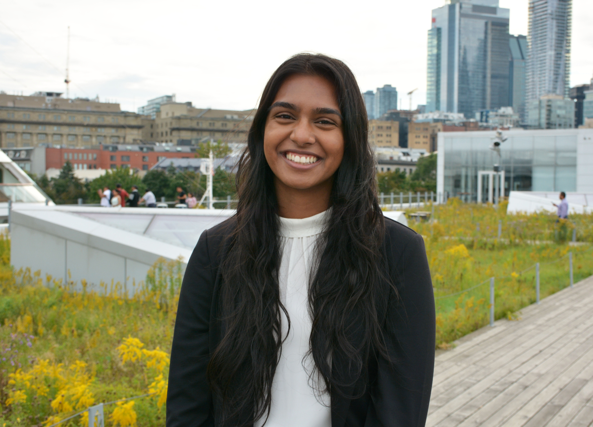

---
hide:
  - navigation
toc:
  depth: 2
---


## Current Members

<div class="team-section"></div>


<div class="team-grid" markdown>

<div class="team-card" markdown>
<div class="team-card-image">
  
</div>
<div class="team-card-content" markdown>
<p class="team-card-name"><strong>Bruno Blais</strong></p>
<p class="team-card-position">Associate Professor</p>
<p class="team-card-research">
<strong>Research Focus:</strong>
<small>High-performance computing tailored towards multiphase flows and process intensification</small></p>
</div>
</div>


<div class="team-card" markdown>
<div class="team-card-image">
  
</div>
<div class="team-card-content" markdown>
<p class="team-card-name"><strong> Victor Oliveira Ferreira </strong></p>
<p class="team-card-position">Postdoctoral Researcher</p>
<p class="team-card-research">
<strong>Research Project:</strong>
<small>Process intensification with CFD and experimental methods</small></p>
</div>
</div>

<div class="team-card" markdown>
<div class="team-card-image">
  
</div>
<div class="team-card-content" markdown>
<p class="team-card-name"><strong> Bruna Campos </strong></p>
<p class="team-card-position">Postdoctoral Researcher</p>
<p class="team-card-research">
<strong>Research Project:</strong>
<small>Matrix-free domain decomposition methods for rotor-stator reactors</small></p>
</div>
</div>

<div class="team-card" markdown>
<div class="team-card-image">
  
</div>
<div class="team-card-content" markdown>
<p class="team-card-name"><strong> Antonella Succar </strong></p>
<p class="team-card-position">Postdoctoral Researcher</p>
<p class="team-card-research">
<strong>Research Project:</strong>
<small>Experimental and numerical analysis of solid–liquid and solid–liquid–gas flows in fluidized beds</small></p>
</div>
</div>


<div class="team-card" markdown>
<div class="team-card-image">
  
</div>
<div class="team-card-content" markdown>
<p class="team-card-name"><strong> Oreste Marquis </strong></p>
<p class="team-card-position">Ph.D. Candidate</p>
<p class="team-card-research">
<strong>Research Project:</strong>
<small>Advanced finite element framework for multiphysics modeling of microwave heating in multiphase systems</small></p>
</div>
</div>

<div class="team-card" markdown>
<div class="team-card-image">
  
</div>
<div class="team-card-content" markdown>
<p class="team-card-name"><strong> Olivier Guévremont </strong></p>
<p class="team-card-position">Ph.D. Candidate</p>
<p class="team-card-research">
<strong>Research Project:</strong>
<small>Pore-resolved CFD and machine learning for the simulation of reactive flows in porous media</small></p>
</p>
</div>
</div>

<div class="team-card" markdown>
<div class="team-card-image">
  
</div>
<div class="team-card-content" markdown>
<p class="team-card-name"><strong> Olivier Gaboriault </strong></p>
<p class="team-card-position">Ph.D. Candidate</p>
<p class="team-card-research">
<strong>Research Project:</strong>
<small>Powder spreading for metal additive manufacturing</small></p>
</p>
</div>
</div>

<div class="team-card" markdown>
<div class="team-card-image">
  
</div>
<div class="team-card-content" markdown>
<p class="team-card-name"><strong> Hélène Papillon Laroche </strong></p>
<p class="team-card-position">Ph.D. Candidate</p>
<p class="team-card-research">
<strong>Research Project:</strong>
<small>Computational modelling of melt pool dynamics in laser powder bed fusion (LPBF) metal additive manufacturing</small></p>
</p>
</div>
</div>

<div class="team-card" markdown>
<div class="team-card-image">
  
</div>
<div class="team-card-content" markdown>
<p class="team-card-name"><strong> Amishga Alphonius </strong></p>
<p class="team-card-position">Ph.D. Student</p>
<p class="team-card-research">
<strong>Research Project:</strong>
<small>Computational modelling of melt pool dynamics in laser powder bed fusion (LPBF) metal additive manufacturing</small>
</p>
</div>
</div>

<div class="team-card" markdown>
<div class="team-card-image">
  
</div>
<div class="team-card-content" markdown>
<p class="team-card-name"><strong> Charles Wilson </strong></p>
<p class="team-card-position">Ph.D. Student</p>
<p class="team-card-research">
<strong>Research Project:</strong>
<small>Dynamics of nonspherical-deformable-particle-laden flows</small>
</p>
</div>
</div>

<!--
<div class="team-card" markdown>
<div class="team-card-image">
  
</div>
<div class="team-card-content" markdown>
<p class="team-card-name"><strong> Paul Alexander Patience </strong></p>
<p class="team-card-position">Ph.D. Candidate</p>
<p class="team-card-research">
<strong>Research Project:</strong>
TODO
</p>
</div>
</div>
-->


<div class="team-card" markdown>
<div class="team-card-image">
  
</div>
<div class="team-card-content" markdown>
<p class="team-card-name"><strong> Wiebke Mainville </strong></p>
<p class="team-card-position">Master's Student</p>
<p class="team-card-research">
<strong>Research Project:</strong>
<small>Control strategies for active cooling systems.</small>
</p>
</div>
</div>

<!--
<div class="team-card" markdown>
<div class="team-card-image">
  
</div>
<div class="team-card-content" markdown>
<p class="team-card-name"><strong> Jacob Tremblay </strong></p>
<p class="team-card-position">Master's Student</p>
<p class="team-card-research">
<strong>Research Project:</strong>
TODO
</p>
</div>
</div>
-->

<div class="team-card" markdown>
<div class="team-card-image">
  
</div>
<div class="team-card-content" markdown>
<p class="team-card-name"><strong> Justin Lamouche </strong></p>
<p class="team-card-position">Master's Student</p>
<p class="team-card-research">
<strong>Research Project:</strong>
<small>Computational modelling of acoustically driven particle-laden flows</small>
</p>
</div>
</div>

</div>

---


<div class="team-card" markdown>
<div class="team-card-image">
  
</div>
<div class="team-card-content" markdown>
<p class="team-card-name"><strong> Marine Harel </strong></p>
<p class="team-card-position">Research Intern</p>
<p class="team-card-research">
<strong>Research Project:</strong>
<small>Extension of the geometric interface reinitialization method to non-linear interface reconstructions</small>
</p>
</div>
</div>


---

## Alumni

We are proud of our alumni who have gone on to successful careers in academia and industry.

### Ph.D.

- **Laura Prieto Saavedra** (2025) 
    - **Thesis Title**: Development of an Efficient Stabilized Navier-Stokes Solver to Simulate Turbulent Flows in Process-Intensified Devices
    - **Current position**: [Scientist and Research Software Engineer - Weierstrass Institute](https://www.wias-berlin.de/contact/staff/index.jsp?lang=1&uname=prieto)

- **Ghazaleh Mirakhori** (2024)  
    - **Thesis Title**: Development of a Model-Free Radioactive Particle Tracking (RPT) Technique for Hydrodynamic Characterization of Industrial-Scale Reactors 
    - **Current position**: Engineering Scientist - Coanda

- **Lucka Barbeau** (2024)  
    - **Thesis Title**: Vers une approche CFD-DEM résolue d'ordre élevé pour la simulation directe d'écoulements autour d'essaims de particules
    - **Current position**: Research Officer - National Research Council Canada

- **Toni El Geitani Nehme** (2023)
    - **Thesis Title**: Development of a Robust Eulerian-Lagrangian Model for Process Intensification of Gas Fluidized and Spouted Beds
    - **Current position**: Associate Data Scientist - Amgen

### M. Sc.

- **Mikael Vaillant** (2025) 
    - **Thesis Title**: Développement d’un modèle de substitution pour un système de  refroidissement actif
    - **Current position**: - 

- **Pierre Joseph Eric Laurentin** (2024) 
    - **Thesis Title**: Développement, implémentation et étalonnage d'un modèle fluide à interface diffuse pour la simulation d'écoulements polyphasiques
    - **Current position**: Solver software developper - MayaHTT

- **Audrey Collard-Daigneault** (2024) 
    - **Thesis Title**:  Développement de stratégies numériques basées sur la DEM et la CFD-DEM améliorant la performance computationnelle de simulations d'écoulements granulaires et polyphasiques 
    - **Current position**: Solver software developper - MayaHTT

- **Valérie Bibeau** (2023)  
    - **Thesis Title**: Développement d'algorithmes d'apprentissage profond adaptés au génie chimique : cinétique chimique et mélange
    - **Current position**: Process performance consultant - Enero Solutions

- **Carole-Anne Daunais** (2022)
    - **Thesis Title**: Développement d'algorithmes d'apprentissage profond adaptés au génie chimique : cinétique chimique et mélange
    - **Current position**: C++ Developer - Transit

- **Bastien Delacroix** (2019)
    - **Thesis Title**: Développement d'un modèle CFD-DEM en référentiel non-inertiel pour des applications au mélange solide-liquide
    - **Current position**: Post-Doc - Centre étude de la neige Météo France

### Post-Doc

- **Shahab Golshan** (2022) 
- **Jeanne Joachim** (2022)  


---


## Join Us

We are always looking for talented and motivated individuals to join our team. If you are interested in:

- **Graduate Studies**: M.Sc. or Ph.D. opportunities
- **Postdoctoral Research**
- **Visiting Researchers**: Collaborative research opportunities
- **Internships**: Undergraduate and graduate research internships.

Please contact us with your CV and research interests. We welcome applications from diverse backgrounds and are committed to fostering an inclusive research environment.

---

<!--
*Note: Replace the placeholder information above with actual team member details, including photos. To add a photo, place the image file in the `docs/assets/` directory and update the `team-card-image` div with:*

```html
<div class="team-card-image">
  
</div>
```
-->